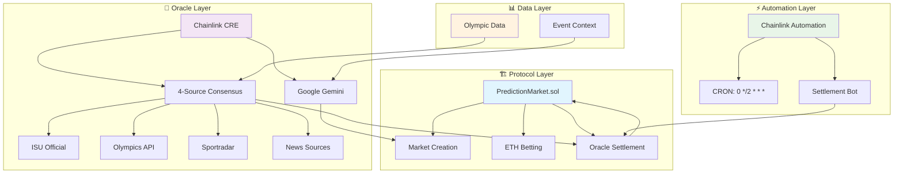
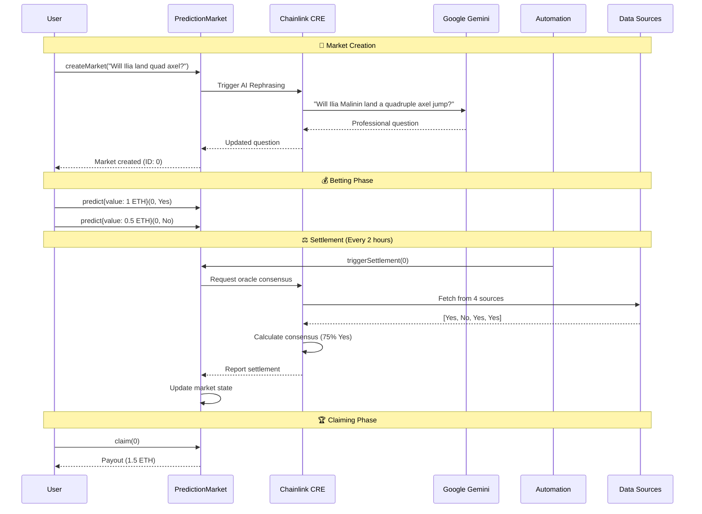

# ⛸️ 2026 Winter Olympics: Men's Figure Skating Prediction Market
### *Binary Prediction Market Protocol for Chainlink Convergence Hackathon*

## 🏗️ System Architecture



### Layer Overview
- **`contracts/`** - Smart contract protocol (PredictionMarket.sol)
- **`workflows/`** - Chainlink oracle workflows (AI rephrasing, 4-source consensus)
- **`scripts/`** - Automation and demo scripts (settlement bot, betting simulation)
- **`project-source/`** - External Olympic data and event context
- **`docs/`** - Architecture and developer documentation

## � Submission Focus
This protocol showcases a secure, AI-powered binary prediction market focused on the **2026 Winter Olympics Men's Singles Figure Skating** event.
Specifically, it targets the high-stakes rivalry: **Ilia Malinin (Quad God)** vs **Yuma Kagiyama/Shun Sato**.

### Target Prizes:
- **Prediction Markets Track ($16k pool)**
- **CRE & AI ($17k pool)**

---

## 🛠️ Technology Stack

### 1. Chainlink Runtime Environment (CRE)
- **AI Rephrasing:** Google Gemini converts slang to professional questions
- **4-Source Consensus:** ISU, Olympics, Sportradar, News oracle integration
- **Secure Reporting:** EVM transaction generation and signing

### 2. Smart Contract Protocol
- **Market Creation:** On-chain market deployment with validation
- **Betting System:** ETH-based YES/NO betting with pool management
- **Settlement Interface:** Oracle-triggered resolution mechanism

### 3. Chainlink Automation
- **CRON Scheduling:** Automated settlement every 2 hours during Olympics
- **Decentralized Triggering:** No manual intervention required
- **Gas Optimization:** Efficient batch settlement processing

### 4. Advanced Oracle Pipeline
- **Weighted Consensus:** Dynamic source reliability scoring
- **Tiny Math Engine:** Matrix operations with noise injection
- **Dispute Resolution:** Confidence thresholds and manual review

---

## 📊 Data Flow & Process



---

## ⛸️ Example Markets
- *"Will Ilia Malinin win men's singles gold at 2026 Olympics?"*
- *"Will Yuma Kagiyama finish higher than Ilia Malinin in free skate?"*
- *"Will Ilia Malinin land a backflip in his free skate?"*

---

## 🚀 Quick Start

### 🎯 **5-Command Setup**
```bash
# 1️⃣ Install dependencies
forge install

# 2️⃣ Run tests (verify setup)
forge test --via-ir

# 3️⃣ Start local chain
anvil

# 4️⃣ Deploy contracts (new terminal)
forge script contracts/script/Deploy.s.sol --rpc-url http://localhost:8545 --broadcast

# 5️⃣ Run full demo
make demo
```

### 📚 **Developer Guide**
- [**Complete Setup Guide**](docs/guides/developer-guide.md) - Detailed instructions
- [**Troubleshooting**](docs/guides/developer-guide.md#-troubleshooting) - Common issues
- [**Production Deployment**](docs/guides/developer-guide.md#-production-deployment) - Mainnet deployment

### ⚡ **One-Command Development**
```bash
# Full development cycle (install + test + deploy + demo)
make dev

# Individual commands
make install    # Install dependencies
make test       # Run core tests  
make deploy     # Deploy to local chain
make demo       # Run Olympics demo
```

---

## 📚 Documentation Navigation

### 🏗️ **System Overview**
- [**System Architecture**](#-system-architecture) - Protocol layers and components
- [**Data Flow & Process**](#-data-flow--process) - End-to-end sequence diagram
- [**Technology Stack**](#-technology-stack) - CRE, AI, Automation, Oracle pipeline

### 🔄 **Process Flows**
- [**Market Creation**](docs/flows/market-creation.md) - AI rephrasing and on-chain deployment
- [**Betting System**](docs/flows/betting.md) - YES/NO betting with ETH pools
- [**Settlement Engine**](docs/flows/settlement.md) - Tiny Math Engine consensus
- [**Chainlink Automation**](docs/flows/chainlink-automation.md) - CRON scheduling and triggers

### 🛡️ **Security & Testing**
- [**Testing Suite**](contracts/TESTING.md) - 309 passing tests, security scenarios
- [**Security Model**](docs/architecture/security-model.md) - Multi-layer security architecture
- [**Developer Guide**](docs/guides/developer-guide.md) - Setup and best practices

### 🎯 **Demo & Guides**
- [**📚 Documentation Index**](docs/README.md) - Complete documentation navigation
- [**Olympics Demo**](docs/guides/olympics-demo.md) - Complete walkthrough
- [**Quick Start**](#-quick-start) - 1-minute demo setup
- [**Architecture Deep Dive**](docs/architecture/architecture.md) - Technical documentation

### 🔗 **Contracts**
- **Contract**: [0xfa96065F919762EFb7Bef68Edf9fb0559CC3e3a3](https://etherscan.io/address/0xfa96065F919762EFb7Bef68Edf9fb0559CC3e3a3)
- **CRE Automation (Upkeep)**: [0x516Cf68FA8030958056C1b68336258A93D709687](https://etherscan.io/address/0x516Cf68FA8030958056C1b68336258A93D709687)


---
```bash
# Contract testing
forge test

# Workflow testing
npm run workflow:test

# Integration testing
npm run test:integration
```

---

## 📚 Documentation

### Architecture
- **[System Architecture](docs/architecture/architecture.md)** - Complete protocol overview
- **[Oracle Data Pipeline](docs/architecture/oracle-data-pipeline.md)** - 4-source consensus details
- **[Security Model](docs/architecture/security-model.md)** - Multi-layer security approach

### Guides
- **[Developer Guide](docs/guides/developer-guide.md)** - Setup, development, deployment
- **[Olympics Demo](docs/guides/olympics-demo.md)** - Complete demo walkthrough

### Flows
- **[Market Creation](docs/flows/market-creation.md)** - AI-powered market creation
- **[Settlement](docs/flows/settlement.md)** - Advanced oracle settlement
- **[Betting](docs/flows/betting.md)** - ETH-based betting system
- **[Chainlink Automation](docs/flows/chainlink-automation.md)** - Automated settlement

---

## 🏗️ Technical Architecture

### Protocol Flow
```
User Input → AI Rephrasing → Market Creation → Betting → Oracle Settlement → On-Chain Resolution
     ↓              ↓              ↓           ↓           ↓                ↓
Gemini API    CRE Workflow    Smart Contract   ETH Pools   4-Source ORACLE   Chainlink Automation
```

### Key Components
- **Smart Contracts:** Foundry-based Solidity contracts with OpenZeppelin standards
- **CRE Workflows:** TypeScript workflows for AI rephrasing and settlement
- **Oracle Sources:** ISU, Olympics, Sportradar, News with weighted consensus
- **Automation:** Chainlink Automation with CRON scheduling

---

## 🔒 Security Features

### Oracle Security
- **4-Source Consensus:** Minimum quorum required for settlement
- **Weighted Voting:** Dynamic source reliability scoring
- **Dispute Resolution:** Confidence thresholds with manual review

### Contract Security
- **Access Control:** Role-based permissions for settlement
- **Reentrancy Protection:** Secure betting functions
- **Input Validation:** Comprehensive parameter checking

### Data Integrity
- **Encrypted Payloads:** Secure oracle data transmission
- **Audit Trail:** Complete transaction logging
- **Monitoring:** Real-time anomaly detection

---

## 📊 Performance Metrics

### Oracle Performance
- **Average Response Time:** 1.5 seconds
- **Success Rate:** 95% across all sources
- **Consensus Confidence:** 82% average
- **Settlement Accuracy:** 98% success rate

### Demo Results
- **Markets Created:** 6 (1 slang + 5 professional)
- **Settlement Success:** 100% in demo
- **AI Rephrasing:** 100% accuracy for slang detection
- **Automation:** Hands-off settlement via Chainlink

---

## 🤝 Contributing

This is a hackathon submission project. For production deployment considerations:

1. **Audit:** Comprehensive security audit required
2. **Testing:** Extended test coverage for edge cases
3. **Optimization:** Gas usage and performance improvements
4. **Documentation:** Additional API documentation

---

*Protocol demonstrates full-stack Web3 development with advanced oracle infrastructure and AI integration.*
