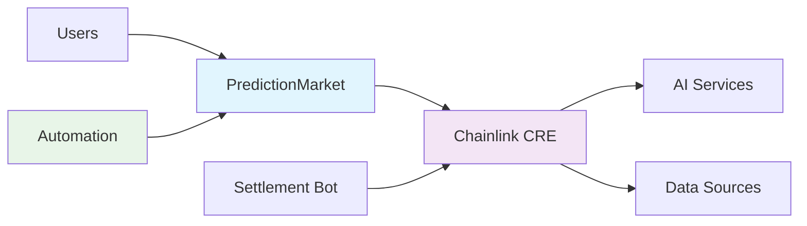

# 🏗️ System Architecture

## 🧭 Navigation
- [← System Overview](../../README.md#-system-architecture)
- [Oracle Data Pipeline](./oracle-data-pipeline.md) →
- [Security Model](./security-model.md) 🛡️
- [Developer Guide](../guides/developer-guide.md) 📚

---

## Overview
The Olympics Prediction Market protocol is built with a layered architecture that separates concerns and ensures scalability.

## Protocol Layers

### 🏗️ Smart Contract Layer
- **PredictionMarket.sol**: Core prediction market logic
- **Market Management**: Creation, betting, settlement
- **Access Control**: Owner/oracle permissions
- **Fund Management**: ETH pools and payouts

### 🔮 Oracle Layer
- **Chainlink CRE**: Decentralized oracle network
- **AI Integration**: Google Gemini for question rephrasing
- **4-Source Consensus**: Multi-source outcome verification
- **Tiny Math Engine**: Advanced consensus algorithms

### ⚡ Automation Layer
- **Chainlink Automation**: CRON-based settlement triggers
- **Settlement Bot**: Automated market resolution
- **Gas Optimization**: Efficient batch processing
- **Error Handling**: Robust failure recovery

### 📊 Data Layer
- **Olympic Data**: Real-time event information
- **Market History**: Betting and settlement records
- **Source Reliability**: Dynamic weight tracking
- **User Predictions**: Encrypted bet storage

## Component Interactions

## Security Architecture

### 🛡️ Multi-Layer Security
- **Smart Contract Security**: OpenZeppelin standards, access controls
- **Oracle Security**: Multi-source consensus, dispute resolution
- **Data Security**: Encrypted predictions, secure storage
- **Network Security**: Chainlink decentralized infrastructure

### 🔒 Access Controls
- **Market Creation**: Owner-only permissions
- **Settlement**: Oracle-only access
- **Fund Management**: Smart contract enforced rules
- **AI Integration**: API key protection

---

## 📚 Related Documentation
- [← System Overview](../../README.md#-system-architecture)
- [Oracle Data Pipeline](./oracle-data-pipeline.md)
- [Security Model](./security-model.md)
- [Market Creation Flow](../flows/market-creation.md)
- [Settlement Flow](../flows/settlement.md)
