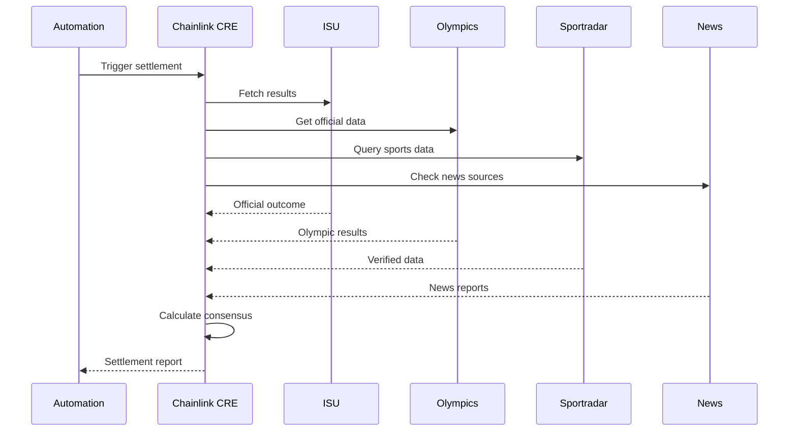

# 🔮 Oracle Data Pipeline

## Overview
The oracle data pipeline aggregates information from multiple sources to provide accurate, reliable outcomes for prediction markets.

## Data Sources

### 🏅 Primary Sources
1. **ISU Official** - International Skating Union results
2. **Olympics API** - Official Olympic data
3. **Sportradar** - Professional sports data provider
4. **News Sources** - Verified sports journalism

### 📊 Data Flow Architecture

## Consensus Algorithm

### 🧮 Tiny Math Engine
- **Matrix Operations**: 4x3 outcome matrix [sign, weight, reliability]
- **Noise Injection**: Seeded variance for competitiveness
- **Weight Adaptation**: PPO-inspired gradient updates
- **Confidence Scoring**: Threshold-based dispute resolution

### ⚖️ Weighted Consensus
1. **Fetch Outcomes**: Collect data from all 4 sources
2. **Apply Weights**: Use dynamic reliability scores
3. **Calculate Consensus**: Weighted voting with advantages
4. **Check Confidence**: 75% threshold for resolution
5. **Update Weights**: Learn from successful predictions

## Data Quality

### 📈 Reliability Scoring
- **Source Performance**: Track accuracy over time
- **Dynamic Weighting**: Adjust based on success rate
- **Variance Analysis**: Detect outlier sources
- **Dispute Handling**: Manual review for low confidence

### 🔍 Validation Process
- **Cross-Reference**: Verify consistency across sources
- **Temporal Analysis**: Check data freshness
- **Source Verification**: Confirm data authenticity
- **Error Detection**: Identify and handle anomalies

---

## 📚 Related Documentation
- [← Architecture Overview](./architecture.md)
- [Security Model](./security-model.md)
- [Settlement Flow](../flows/settlement.md)
- [Chainlink Automation](../flows/chainlink-automation.md)
