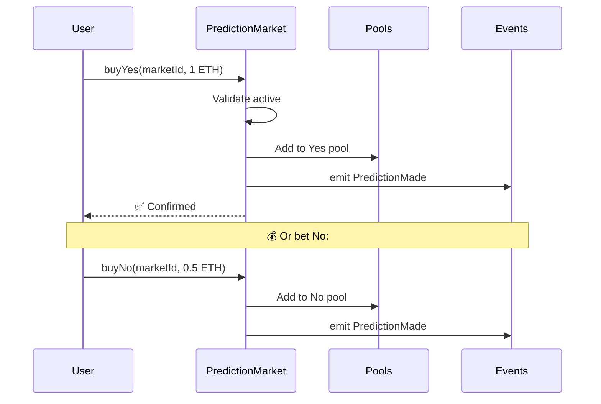

# Betting Flow

## Overview
Allow users to bet YES/NO on prediction markets with ETH.

## Betting Process



## Steps
1. User selects market ID, side (yes/no), amount
2. Validate market exists, not settled
3. Call `buyYes` or `buyNo` on contract
4. Update pool balances
5. Emit PredictionMade event

## Files
- `contracts/src/PredictionMarket.sol` (buyYes/buyNo functions)
- `mock-bets.ts` (demo betting script)
- `place-mock-bets.sh` (demo script)

## ABI
```json
{
  "buyYes(uint256)": "payable",
  "buyNo(uint256)": "payable"
}
```

---

## 📚 Related Documentation
- [← System Architecture](../../README.md#-system-architecture)
- [Market Creation](./market-creation.md)
- [Settlement Flow](./settlement.md)
- [Chainlink Automation](./chainlink-automation.md)
