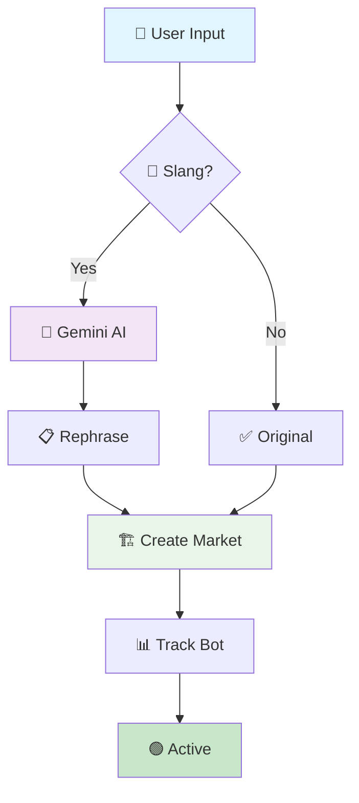

# Market Creation Flow

## 🧭 Navigation
- [← System Architecture](../README.md#-system-architecture)
- [Betting Flow](./betting.md) →
- [Settlement Flow](./settlement.md) →
- [Developer Guide](../guides/developer-guide.md) 📚

---

## Overview
Transform slang-heavy user questions into professional prediction markets using AI rephrasing.

## Process Flow

## Steps
1. User inputs slang question (e.g., "Will Ilia moon gold?")
2. Detect slang keywords ("moon", "rekt", "ape")
3. If slang detected, call Gemini API to rephrase
4. Create on-chain market with rephrased question
5. Track market in settlement bot database

## Files
- `workflows/workflow.ts` (main logic)
- `scripts/demo/demo-olympics.sh` (demo script)
- `scripts/demo/create_payload.json` (input example)

## Output
JSON: `{"status": "Success", "message": "Market created: \"Will Ilia win gold?\"", "links": {...}}`

---

## 📚 Related Documentation
- [← System Architecture](../../README.md#-system-architecture)
- [Betting Flow](./betting.md)
- [Settlement Flow](./settlement.md)
- [Chainlink Automation](./chainlink-automation.md)
